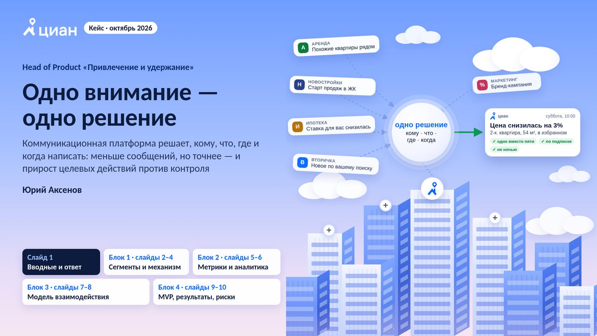

# Кейс ЦИАН — основная часть презентации

Head of Product «Привлечение и удержание» · Юрий Аксенов · октябрь 2026

Основная часть: обложка, слайды 1–10, финал. **Без приложения.**

## Как смотреть

- **PDF** — [cian-main.pdf](cian-main.pdf): 12 страниц, открывается прямо на GitHub.
- **Живая версия с анимацией** — онлайн: https://aksenovyuri2.github.io/new/ · или скачайте папку `presentation` и откройте [index.html](index.html) в браузере.
  - ← → / пробел / клик — листать
  - F — полный экран
  - N — заметки докладчика
- **Заметки докладчика** — [notes.md](notes.md).

## Слайды

| № | Слайд | Заголовок | |
|---|---|---|---|
| 1 | обложка | Одно внимание — одно решение | [превью](preview/01.jpg) |
| 2 | 01 | Убираем лишнее, выбираем лучшее, меряем к контролю | [превью](preview/02.jpg) |
| 3 | 02 | Сегмент — это этап пути: его видно по действиям в продукте | [превью](preview/03.jpg) |
| 4 | 03 | Массовую рассылку сначала пробуем на выборке, частоту снижаем на переспам-сегментах | [превью](preview/04.jpg) |
| 5 | 04 | Квоты вертикалей — из целей бизнеса и инкрементального дохода; дальше — аукцион | [превью](preview/05.jpg) |
| 6 | 05 | Главная — инкрементальный LTV платформы минус затраты на каналы и выгорание аудитории | [превью](preview/06.jpg) |
| 7 | 06 | Прирост меряем только к контролю; новые правила раскатываем ступенями 10 → 50 → 95% | [превью](preview/07.jpg) |
| 8 | 07 | В центр — только то, что ломается на стыке команд | [превью](preview/08.jpg) |
| 9 | 08 | Вертикаль предлагает, платформа решает, что дойдёт; за общий доход отвечает Продукт | [превью](preview/09.jpg) |
| 10 | 09 | MVP за квартал: регламент экспериментов, согласия, пробная отправка, контроль; модели — потом | [превью](preview/10.jpg) |
| 11 | 10 | 3 мес. — новые правила у половины аудитории; 6 мес. — рост инкрементального дохода и меньше отписок | [превью](preview/11.jpg) |
| 12 | финал | Спасибо! | [превью](preview/12.jpg) |

## Что внутри

- `index.html` — вся презентация одной страницей: слайды 1920×1080 масштабируются под окно, анимации обложки и финала проигрываются при показе слайда.
- `slides/` — исходники каждого слайда (HTML).
- `img/` — схемы и фоны слайдов.
- `fonts/` — шрифт Carlito (SIL Open Font License 1.1, текст лицензии — `fonts/OFL-LICENSE.txt`).
- `preview/` — превью слайдов.
